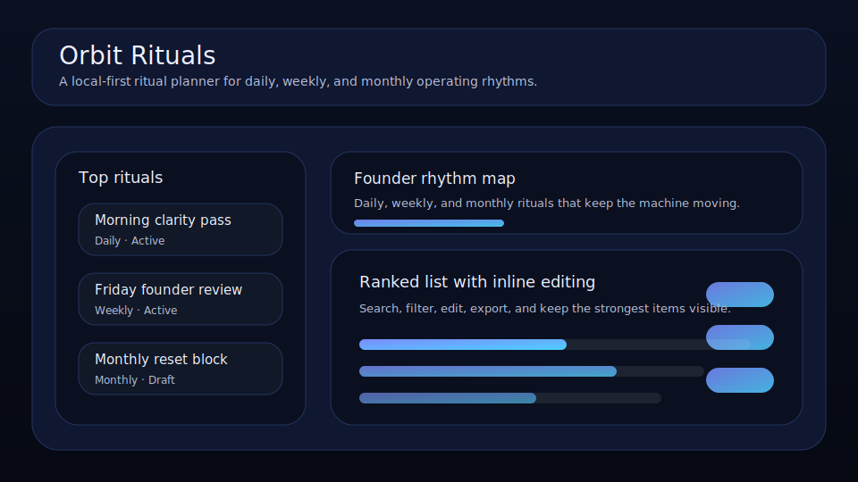

# Orbit Rituals

A local-first ritual planner for daily, weekly, and monthly operating rhythms.



Orbit Rituals is a focused rhythm board for founders, operators, and solo builders who want their routines to survive real work pressure. It helps you design rituals with cues, streaks, duration, and next-due timing so the operating system behind the business stays visible.

## What it does

- ranks rituals by leverage, consistency, and urgency
- tracks **cue**, **last done**, **next due**, **duration**, and **streak** for each rhythm
- highlights the most consistent ritual, the one slipping, and the biggest ritual block
- includes quick actions for logging a ritual today, nudging the next due date, and resetting a streak when a rhythm breaks
- renders a “today orbit” queue and cadence distribution beneath the main board
- saves locally in the browser with JSON import/export backups

## Why it feels different

Orbit Rituals is not a generic habit tracker. It is built around operational rhythms, the repeatable actions that keep a business calm, intentional, and moving forward even when the week gets messy.

## Quick start

```bash
git clone https://github.com/get2salam/orbit-rituals.git
cd orbit-rituals
python -m http.server 8000
```

Then open <http://localhost:8000>.

## Runnable backup example

Try the launch-week backup fixture without creating data by hand:

1. Start the local server from the quick start.
2. Open <http://localhost:8000> and choose **Import**.
3. Select `docs/sample-backup.json`.

The example imports three launch-week rituals with daily, weekly, and recovery cadences so you can verify the board ranking, search state, and import flow quickly. To check that the documented backup still matches the app’s accepted categories, states, cadence dates, and priority queue, run:

```bash
node --test tools/backup-example.test.mjs
```

## Keyboard shortcuts

- `N` creates a new ritual
- `/` focuses the search box

## Local verification

Catch broken asset references and scoring regressions before they land on `main`:

```bash
npm run verify
```

The check walks `index.html` and `README.md` for local `src`, `href`, and image references, then runs deterministic `node:test` coverage for the ritual scoring engine. Asset checks exit non-zero if any path is missing from disk; external URLs, anchors, and `data:` URIs are skipped. The same verification suite runs on every push and pull request via the `verify` GitHub Actions workflow.

## Data shape

```json
{
  "boardTitle": "Founder rhythm map",
  "items": [
    {
      "title": "Morning clarity pass",
      "category": "Daily",
      "state": "Active",
      "score": 9,
      "streak": 6,
      "duration": 20,
      "cue": "Before opening chat apps",
      "lastDone": "2026-04-24",
      "nextDue": "2026-04-25"
    }
  ]
}
```

## Privacy

Everything stays in your browser unless you export a JSON backup.

## License

MIT
